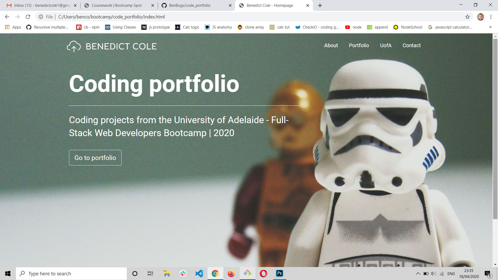

# Code Portfolio

This portfolio has been built to showcase the mix of professional and academic projects I have worked on over the last 18 months. 

Aspects of the site are yet to be completed including the University sylabus page and the contact form.

## Technology

This project was built using:

- HTML 5, Bootstrap 4.4.1, and custom CSS
- JavaScript
- OpenWeather API
- Luxon date and time library

